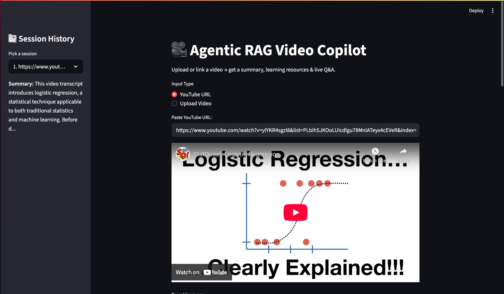
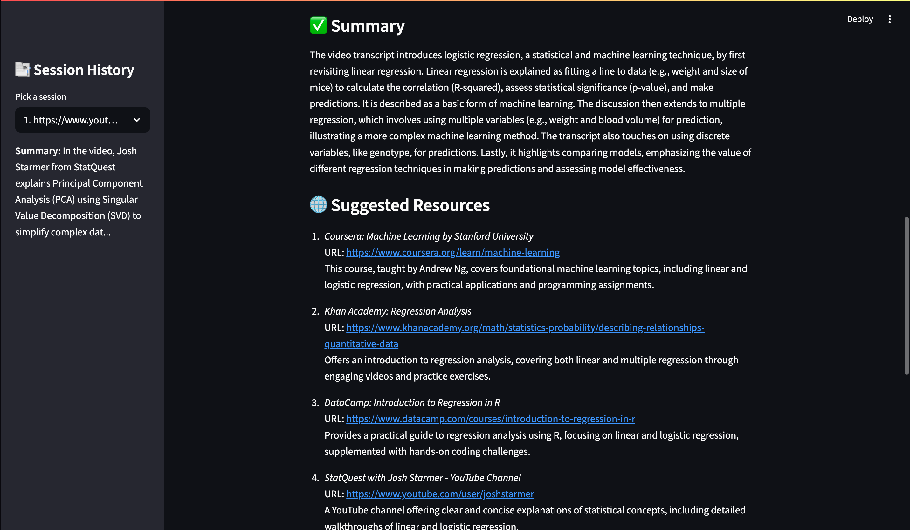
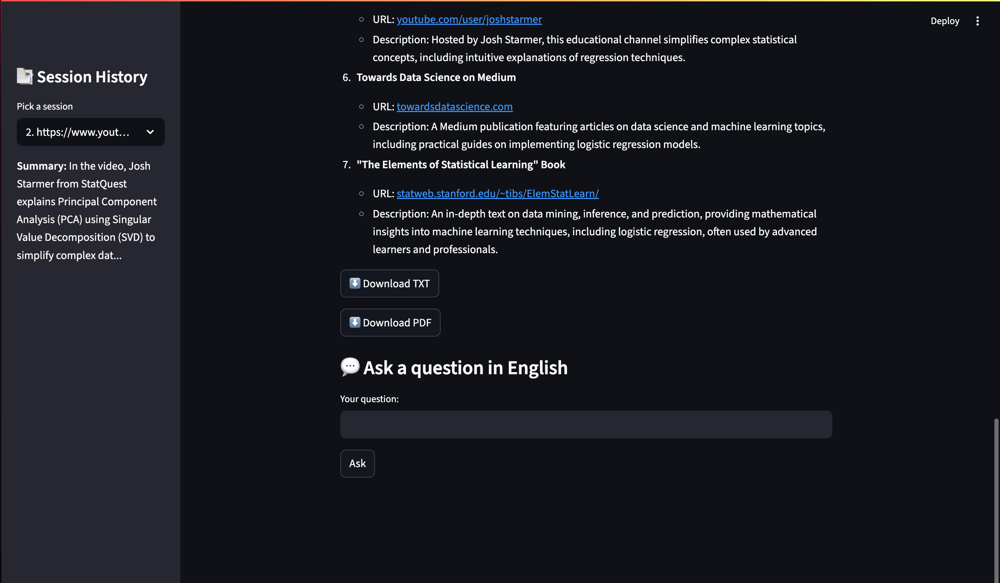

# 🎥 Agentic Video Copilot

An **AI-powered Agentic Copilot** for video summarization, resource recommendations, and interactive Q&A — orchestrated with LangGraph, multiple lightweight LLM “agents”, and a simple Streamlit UI with persistent local session memory.

---

## 📌 **Description**

**Agentic Video Copilot** is an interactive tool where users can:

->Upload a video file or provide a YouTube URL
->Automatically transcribe the audio
->Generate a summary in any target language
->Get GPT-generated learning resources (RAG style) related to the video content
->Download the output as .txt and .pdf reports
->Ask follow-up questions in the same language through an integrated Q&A agent
->Keep a persistent session history, saved locally (/sessions/), visible in the sidebar — just like a chat log

This project demonstrates LangGraph-based Agentic AI, RAG workflows, and modular multi-agent orchestration — showcasing how LLM pipelines can power real user-facing products.

---

## ⚙️ **Methodology**

->**LangGraph Orchestration:** All tasks (Transcriber, Summarizer, RAG, Q&A) are wired as separate nodes in a single LangGraph StateGraph, passing context (TypedDict) step by step.
->**Transcriber Agent:** Extracts audio and transcripts using YouTube transcripts or fallback ASR.
->**Summarizer Agent:** Condenses raw text into a clear summary, in any target language.
->**RAG Agent:** Uses GPT to generate realistic, helpful resources, tutorials, or learning references related to the video.
->**Q&A Agent:** Lets users ask questions about the video; answers are generated with GPT using the stored summary and resources.
->**Persistent Session Storage:** Each run (summary, resources, Q&A log) is stored as a JSON file in /sessions/ so history survives page refresh or app restart.

---

## 🛠️ **Tools & Tech Used**

| Aspect                   | Details                                           |
|------------------------- |-------------------------------------------------- |
| **Language**             | Python 3.x                                        |
| **Framework**            | [Streamlit](https://streamlit.io/)                |
| **Graph Orchestration**  | LangGraph                                         |
| **LLM API**              | [OpenAI Python SDK](https://platform.openai.com/) |
| **Transcription**        | `youtube-transcript-api`, `pytube`                |
| **Export**               | `fpdf` for PDF generation                         |
| **Persistence**          | Local disk storage (`sessions/` folder, JSON)     |
| **State Orchestration**  | LangGraph StateGraph + Python TypedDict           |

---

## 🗂️ **Project Structure**


```plaintext
[User Uploads Video or URL]
              |
              ▼
   [Transcriber Node — LangGraph]
              |
              ▼
   [Summarizer Node — LangGraph]
              |
              ▼
   [RAG Node — LangGraph]
              |
              ▼
   [Q&A Node — LangGraph]
              |
              ▼
 [Session Saved to /sessions/]
              |
              ▼
 [Sidebar: Persistent History Viewer]
```

## 🎯 ** Key Highlights**

✅ True LangGraph Orchestration: Each agent runs as a LangGraph node with clear context flow.
🌍 Multilingual Output: Summaries and Q&A in the target language.
💾 Durable Memory: Session runs and Q&A logs are stored locally and survive refresh.
📚 RAG-style Resources: GPT suggests relevant external resources without extra search APIs.
📥 One-click Export: Download clean .txt and .pdf reports.
🔓 Fully Local: No cloud DB needed — simple JSON snapshots.

## **Demo**




