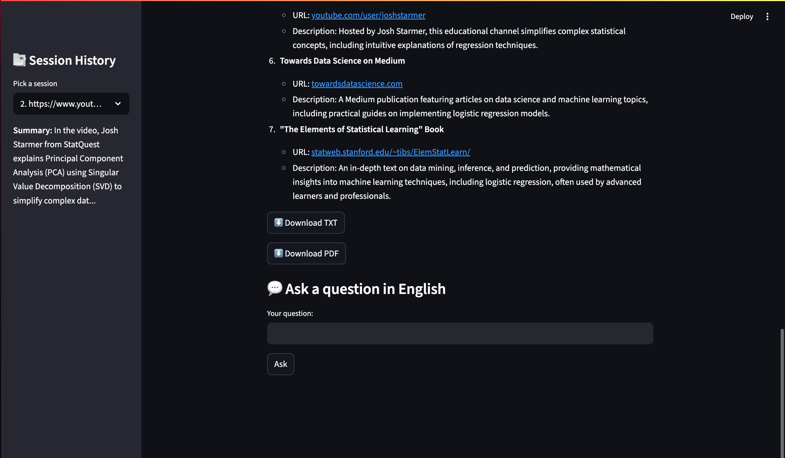

# 🎥 Agentic RAG Video Copilot

An **AI-powered Agentic Copilot** for video summarization, resource recommendation, and interactive Q&A — all orchestrated with multiple lightweight LLM “agents” using Streamlit and local session memory.

---

## 📌 **Description**

**Agentic RAG Video Copilot** is an interactive tool where users can:
- **Upload a video file** or **provide a YouTube URL**
- Automatically **transcribe the audio**
- Generate a **summary** in any **target language**
- Get **GPT-generated learning resources** (RAG style) related to the video
- Download the output as `.txt` and `.pdf` reports
- Ask **follow-up questions** in the same language through an integrated Q&A agent
- Keep a **persistent session history**, saved on local disk, viewable in a sidebar — just like a conversation log

This demonstrates **Agentic AI**, **RAG**, and simple session orchestration — perfect for showcasing AI orchestration and user-facing product skills.

---

## ⚙️ **Methodology**

- **Transcriber Agent**: Handles YouTube or uploaded video files, extracts audio, and generates transcripts using OpenAI’s ASR model or YouTube transcripts.
- **Summarizer Agent**: Condenses the raw transcript into a concise summary, styled as paragraphs or notes, and in any target language selected by the user.
- **RAG Agent (Retrieval-Augmented Generation)**: Uses GPT to generate realistic, helpful resources, tutorials, or reading lists based on the summary.
- **Q&A Agent**: Lets the user ask follow-up questions about the video content. The agent answers using the summary and resource context, always replying in the selected language.
- **Session History**: Each run (summary + resources + Q&A log) is stored on local disk (`/sessions/`) as a JSON snapshot, making session history durable and viewable even after app refresh.

---

## 🛠️ **Tools & Tech Used**

| Aspect              | Details                                    |
|---------------------|--------------------------------------------|
| **Language**        | Python 3.x                                 |
| **Framework**       | [Streamlit](https://streamlit.io/)         |
| **LLM API**         | [OpenAI Python SDK](https://platform.openai.com/) |
| **Transcription**   | `youtube-transcript-api`, `pytube`         |
| **Export**          | `fpdf` for PDF generation                  |
| **Persistence**     | Local disk storage (`sessions/` folder, JSON) |
| **State Orchestration** | Streamlit `session_state` for passing context |

---

## 🗂️ **Project Structure**


```plaintext
[User Uploads Video or URL]
              |
              ▼
     [Transcriber Agent]
              |
              ▼
     [Summarizer Agent]
              |
              ▼
         [RAG Agent]
              |
              ▼
     [Session Saved to Disk]
              |
              ├─────────► [Sidebar: History Viewer]
              |
              ▼
         [Q&A Agent]
              |
              ▼
      [Updated Session Saved]
```

## 🎯 ** Key Highlights**

⚡ Agentic Orchestration: Each task is handled by a modular LLM agent.
🌍 Multilingual Output: Users choose any target language.
💾 Persistent Memory: Runs survive page refresh via local disk snapshots.
📚 RAG-style Resources: GPT suggests real-sounding external learning paths.
📥 Clean Exports: Download .txt and .pdf summaries with a single click.
🧩 No Cloud DB Required: Entire history is local, transparent, and portable.

## **Demo**



